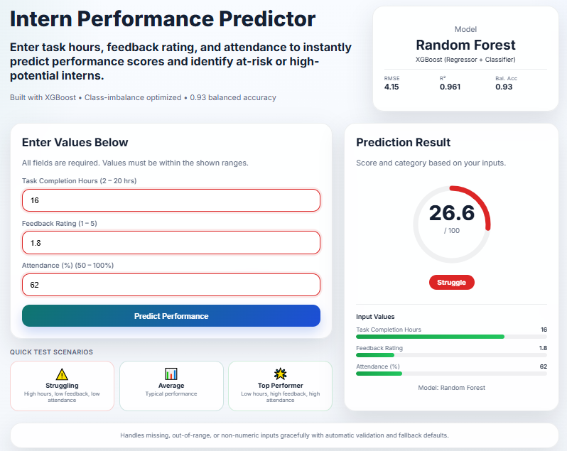

# Intern Performance Predictor


[](https://github.com/awais-dev-ai/Internee_Performance_Predictor/actions/workflows/ci.yml)
[](https://huggingface.co/spaces/awais-dev-ai/Intern-Performance-Predictor)

**Predict intern performance and flag struggling/excellent interns using ML with class imbalance handling.**

## Business Problem

Companies need to identify:
- **Struggling interns** (≤ default 40 score, optimized cutoff from metadata) → coaching intervention
- **Excellent interns** (≥ default 75 score, optimized cutoff from metadata) → advanced assignments
- **Average interns** (in between) → standard track

> Classification uses grid-searched thresholds stored in `model_metadata.pkl` (`threshold_optimization`); the defaults are 40/75. The exact values are printed by the training pipeline and notebook.

Challenge: In real data, Struggle and Excel interns are rare (~15% each), making them hard to predict accurately.

## Solution

**Multi-layer class imbalance strategy:**
1. **15/70/15 data distribution** — mimics real intern populations (initial generation)
2. **Oversampling with jitter** — boosts minority classes toward the majority count (note: post-oversampling proportions are no longer exactly 15/70/15)
3. **Sample-weighted training** — gives higher weight to Struggle/Excel during training
4. **Stratified splitting** — preserves class proportions in train/test sets
5. **Composite model selection** — balances RMSE + balanced accuracy
6. **Threshold optimization** — grid search finds optimal cutoffs (not hardcoded 40/75)

## Results

| Metric | Value |
|--------|-------|
| **Model** | XGBoost |
| **RMSE** | 4.04 |
| **MAE** | 2.98 |
| **R²** | 0.966 |
| **Accuracy** | 0.917 |
| **Balanced Accuracy** | 0.935 |
| **Macro F1** | 0.927 |

### Per-Class Performance (F1)

> Reported by the analysis notebook (`notebooks/Intern_Performance_Analysis.ipynb`, §16).

| Class | F1 |
|-------|----|
| **Excel** | 0.899 |
| **Average** | 0.917 |
| **Struggle** | 0.965 |

> **Note:** These metrics are achieved on a **synthetic dataset** generated to mimic intern performance patterns. In real-world production with noisy, incomplete HR data, these numbers would require re-evaluation with real data, feature engineering, and continuous monitoring.

**Key insight:** The pipeline demonstrates strong recall for minority classes on synthetic benchmarks, validating the class-imbalance strategy (oversampling, sample weights, threshold tuning). In production with real HR data, this would require continuous validation and drift monitoring.

## Web Interface



*The Flask web app lets users input task completion hours, feedback rating, and attendance percentage to get instant predictions. Input validation ensures all fields are filled with valid numeric values within expected ranges.*

## Quick Start

### Option 1: Run Locally (Python)

```bash
# Install dependencies
pip install -r requirements.txt

# Train and run the app
python app.py
# Open http://127.0.0.1:5000
```

### Option 2: Run with Docker

```bash
# Build and start
docker-compose up

# Open http://localhost:7860  (container port; HF uses 7860)
```

### Option 3: Train Only (CLI)

```bash
python main.py
```

## Features

- **Regression model** predicts continuous performance score (0-100)
- **Classification layer** buckets into Excel/Average/Struggle
- **Class imbalance handling** — sample weights, oversampling, stratified split
- **Threshold optimization** — grid search for best classification cutoffs
- **Explainability** — SHAP values + feature importance
- **Web interface** — Flask form for real-time predictions with input validation (empty field checks, numeric type enforcement, range bounds)
- **Unit tests** — pytest suite covering data, models, preprocessing, and web app (see `tests/`)

## Project Structure

```
├── .github/workflows/
│   └── ci.yml              # CI/CD: runs tests + training on push
├── .dockerignore
├── Dockerfile              # Container definition
├── docker-compose.yml      # One-command deployment
├── requirements.txt        # Python dependencies
├── app.py                  # Flask entry point (listens on PORT, default 5000; Docker sets PORT=7860)
├── main.py                 # Training pipeline (CLI)
├── wsgi.py                 # WSGI entry point (gunicorn/waitress)
├── src/
│   ├── __init__.py
│   ├── data_generation.py     # Synthetic data with 15/70/15 distribution
│   ├── preprocessing.py       # Stratified splitting, validation
│   ├── model_training.py      # Sample weights, composite selection
│   ├── evaluation.py          # Threshold optimization
│   ├── interpretation.py     # Feature importance
│   └── eda.py                 # EDA helpers
├── ui/
│   └── __init__.py            # Flask app factory
├── notebooks/
│   └── Intern_Performance_Analysis.ipynb  # Full analysis with plots
├── tests/                    # Unit tests (see tests/ for current count)
└── data/                     # Generated datasets
```

## Notebook Visualizations

The notebook ([`Intern_Performance_Analysis.ipynb`](notebooks/Intern_Performance_Analysis.ipynb)) includes:

### 1. Data Distribution
- Histograms of all features and target
- Correlation heatmap
- Scatter plots (feature vs performance)

### 2. Model Comparison
- Actual vs Predicted scatter plots for Random Forest & XGBoost
- Residual analysis (residuals vs predicted, histogram, Q-Q plot)

### 3. Model Interpretation
- **SHAP summary plot** — feature contributions
- **Feature importance bar chart** — built-in sklearn/XGBoost importances

### 4. Classification Results
- Confusion matrix (Excel/Average/Struggle)
- Per-class F1
- Threshold optimization visualization (optional)

## Deployment — Hugging Face Spaces

The app is automatically built and deployed to [Hugging Face Spaces](https://huggingface.co/spaces/awais-dev-ai/Intern-Performance-Predictor) via the `deploy-hf` job in the CI workflow (`ci.yml`) on every successful push to `main`. A Docker SDK Space is used, matching the project `Dockerfile` (served on port 7860).

A step-by-step manual deployment guide is available in [`HUGGINGFACE.md`](HUGGINGFACE.md). The live demo can also be opened directly from the **Open In Spaces** badge at the top of this README.

## Architecture

### Training Pipeline

```
generate_synthetic_data()
    └─ 15% Struggle + 70% Average + 15% Excel (initial generation)
    └─ Oversample minority classes with Gaussian jitter toward majority count
       ↓
train_val_test_split(stratify=True)
    └─ Splits into Train / Validation (15%) / Test (20%), preserving stratified proportions
       ↓
tune_candidate_models(use_sample_weights=True)
    └─ 5-fold GridSearchCV over Random Forest + XGBoost
    └─ Inverse class frequency weights (Struggle/Excel get higher weight)
       ↓
select_best_model(fitted_models, X_val, y_val, alpha=0.5)
    └─ Composite on VALIDATION set: 0.5 * (1 - normalized_rmse) + 0.5 * balanced_accuracy
       ↓
optimize_thresholds(metric="macro_f1")
    └─ Grid search on VALIDATION predictions: struggle_range=[30-50], excel_range=[65-85]
    └─ Finds optimal Struggle/Excel cutoffs (stored in metadata; defaults 40/75)
       ↓
regression_metrics(X_test, y_test)  # Final unbiased test-set reporting
       ↓
save_model_artifacts()  # model + metadata with thresholds
```

### Inference Flow

```
User Input (Flask form)
    ↓  Input validation (empty fields, numeric type, range bounds)
    ↓
prepare_prediction_frame()  # clean + validate
    ↓
model.predict()  # XGBoost
    ↓
classify_performance(thresholds from metadata)
    ↓
Return: score + category (Struggle/Average/Excel)
```

## Tech Stack

| Component | Technology |
|-----------|-----------|
| **Language** | Python 3.12 |
| **ML** | XGBoost, Random Forest (scikit-learn) |
| **Web** | Flask 3.0 |
| **Explainability** | SHAP |
| **Testing** | pytest |
| **CI/CD** | GitHub Actions |
| **Deployment** | Docker, Docker Compose, Hugging Face Spaces |

## Key Design Decisions

### Why oversampling instead of SMOTE?
- **Simpler** — no need for nearest-neighbor computation
- **Effective** — Gaussian jitter creates natural variation
- **Fast** — works well with tree-based models

### Why composite model selection?
- **Balanced** — considers both regression accuracy and classification quality
- **Ensures** — minority classes aren't sacrificed for overall RMSE

### Why grid search for thresholds?
- **Adaptive** — finds optimal cutoffs for your data
- **Business-aware** — optimizes for Macro F1, not just accuracy
- **Transparent** — you can see the exact thresholds used

## Business Impact

### Before (Baseline / Unoptimized approach)
- 25/50/25 distribution
- No imbalance handling
- Struggle recall: ~60-70%
- Hardcoded thresholds (40/75)

### After (Optimized pipeline)
- 15/70/15 initial distribution, minority-boosted via oversampling
- Full imbalance strategy
- **Struggle F1: 0.965 on synthetic test set** — validates the imbalance-handling approach
- Optimized thresholds stored in metadata (grid search; defaults 40/75)

## Future Improvements

- Replace synthetic data with real intern records
- Add SHAP waterfall plots for individual predictions
- Implement model monitoring for data drift
- Add authentication for production deployment
- A/B testing framework for threshold strategies

## License

MIT License — feel free to use this project for learning or as a portfolio piece.

## Author

**Awais Ahmad**  
Email: awaisahmad.dev.ai@gmail.com  
LinkedIn: [linkedin.com/in/awaisahmad-dev-ai](https://www.linkedin.com/in/awaisahmad-dev-ai/)

Built to demonstrate production-grade ML engineering, class-imbalance handling, and full-stack deployment.